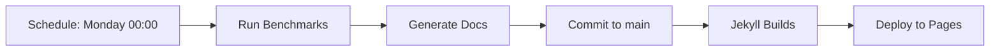

# GitHub Actions Workflows

This directory contains CI/CD workflows for the template project.

## Workflows

### 🧪 CI (`ci.yml`)
**Triggers:** Push to main, Pull requests
**Purpose:** Continuous integration checks

**Jobs:**
- Formatting check (rustfmt)
- Linting (clippy)
- Tests (unit + integration)
- Multiple platform builds (Linux, macOS, Windows)
- Documentation build (`cargo doc`)
- Security audit (`cargo audit`)
- MSRV check (`cargo check`)

**Usage:** Automatically runs on every push and PR

---

### 📊 Benchmarks (`benchmarks.yml`)
**Triggers:**
- Schedule (Weekly on Monday 00:00 UTC)
- Manual trigger (workflow_dispatch)

**Purpose:** Run `cargo bench` and upload the output as an artifact

**Output:** an artifact named `bench-output-<sha>` containing `bench-output.txt`.

**Manual Trigger:** `gh workflow run benchmarks.yml`

---

### 📄 Jekyll Pages (`jekyll-gh-pages.yml`)
**Triggers:** Push to main
**Purpose:** Deploy documentation to GitHub Pages

**Jobs:**
1. **Build** - Build Jekyll site from `docs/`
2. **Deploy** - Publish to GitHub Pages

**Usage:** Automatically runs after benchmark workflow commits

---

### 🔄 Maintenance (`maintenance.yml`)
**Purpose:** Periodic maintenance tasks
**Status:** Check file for current configuration

---

### 🚀 Release (`release.yml`)
**Triggers:** Push to release tags
**Purpose:** Create GitHub releases
**Status:** Intended as a starting point; adjust to your release process.

---

## Benchmark CI/CD Flow

### Automatic (Weekly)



### Manual Trigger

```bash
# Run benchmarks now
gh workflow run benchmarks.yml

# Run and create snapshot
gh workflow run benchmarks.yml -f create_snapshot=v0.2.0
```

### On Release Tag

```bash
git tag v0.2.0
git push origin v0.2.0
```

This automatically:
1. Runs benchmarks
2. Creates version snapshot at `docs/benchmarks/v0.2.0/`
3. Updates latest results
4. Deploys to Pages

---

## Environment Setup

### Required Secrets

None currently required for public repositories.

### Required Permissions

The `benchmarks.yml` workflow requires:
- ✅ `contents: write` - To commit benchmark results
- ✅ `pages: write` - Inherited from Jekyll workflow
- ✅ `id-token: write` - For GitHub Pages deployment

### GitHub Pages Configuration

1. **Go to:** Repository Settings → Pages
2. **Source:** Deploy from a branch
3. **Branch:** `gh-pages` (created by Jekyll workflow)
4. **Directory:** `/ (root)`

Alternatively, use GitHub Actions deployment (recommended):
1. **Source:** GitHub Actions
2. **Workflow:** `jekyll-gh-pages.yml` handles deployment

---

## Benchmark Results Location

### Latest Results (Always Current)
- **URL:** `https://oxidizelabs.github.io/template/benchmarks/latest/`
- **Path:** `docs/benchmarks/latest/`
- **Updated:** Weekly + on-demand + on release

### Version Snapshots (Historical)
- **URL:** `https://oxidizelabs.github.io/template/benchmarks/v0.2.0/`
- **Path:** `docs/benchmarks/v0.2.0/`
- **Created:** On release tags only

---

## Local Development

### Run Benchmarks Locally

```bash
# Full workflow
./scripts/update_benchmark_docs.sh

# Manual steps
cargo bench --bench runner
cargo run --package bench-support --bin render_docs -- \
    target/benchmarks/<run-id>/results.json \
    docs/benchmarks/latest

# View results
open docs/benchmarks/latest/charts.html
```

### Test Workflow Locally

Using [act](https://github.com/nektos/act):

```bash
# Install act
brew install act  # macOS
# or: curl https://raw.githubusercontent.com/nektos/act/master/install.sh | sudo bash

# Run benchmark workflow
act schedule -W .github/workflows/benchmarks.yml

# Run with specific inputs
act workflow_dispatch -W .github/workflows/benchmarks.yml \
    -e <(echo '{"inputs":{"create_snapshot":"v0.2.0"}}')
```

---

## Customization

### Change Benchmark Schedule

Edit `benchmarks.yml`:

```yaml
schedule:
  - cron: '0 0 * * 1'  # Weekly on Monday
  # Change to:
  # - cron: '0 0 * * *'  # Daily at midnight
  # - cron: '0 0 1 * *'  # Monthly on 1st
```

### Add Benchmark to PR Comments

Already configured! The workflow will comment on PRs with benchmark results if the workflow is triggered on PR events.

To enable:

```yaml
on:
  pull_request:  # Add this trigger
    branches: [main]
```

**Note:** This will increase CI time. Consider using a subset of benchmarks for PRs.

### Run Subset of Benchmarks

Create a new workflow or modify `benchmarks.yml`:

```yaml
- name: Run quick benchmarks (PR only)
  if: github.event_name == 'pull_request'
  run: |
    # Run only hit rate benchmarks
    cargo bench --bench workloads -- hit_rate
```

---

## Troubleshooting

### Benchmarks Don't Show on GitHub Pages

**Check:**
1. Workflow ran successfully: Actions tab → Benchmarks
2. Results were committed: `docs/benchmarks/latest/` exists
3. Jekyll deployed: Actions tab → Jekyll Pages
4. Pages enabled: Settings → Pages

**Fix:**
```bash
# Manually trigger Jekyll deployment
gh workflow run jekyll-gh-pages.yml
```

### Workflow Fails with "No benchmark results found"

**Cause:** Benchmark binary didn't run or crashed

**Fix:**
1. Check benchmark logs in workflow run
2. Test locally: `cargo bench --bench runner`
3. Check for compilation errors or panics

### Results Not Updating

**Cause:** Workflow might be skipping commit (no changes)

**Check:**
```bash
# View workflow logs
gh run list --workflow=benchmarks.yml
gh run view <run-id>
```

### Permission Denied on Push

**Cause:** Workflow doesn't have write permissions

**Fix:** Ensure `permissions: contents: write` in `benchmarks.yml`

---

## Performance Considerations

### CI Runner Variability

⚠️ **Warning:** GitHub-hosted runners have variable performance
- CPU: Different models
- Load: Shared with other workflows
- Network: Variable latency

**Recommendations:**
1. **Relative comparison only** - Compare trends, not absolute numbers
2. **Self-hosted runners** - Use dedicated machine for consistency
3. **Baseline tracking** - Store baseline from tagged releases

### Benchmark Duration

Current suite runs ~5-10 minutes on GitHub runners.

**To reduce:**
- Decrease operation count in `benches/runner.rs`
- Run subset of benchmarks on PR
- Use `--bench reports` for quick checks

---

## Best Practices

✅ **DO:**
- Run full benchmarks on schedule (weekly)
- Create snapshots on releases
- Use manual trigger for pre-release validation
- Review benchmark results before merging

❌ **DON'T:**
- Run full benchmarks on every PR (slow)
- Compare absolute numbers across different runners
- Trust single measurements (check trends)
- Block releases on benchmark results (use as guidance)

---

## Security

### Secrets in Benchmarks

The workflow does NOT access:
- API keys
- Credentials
- Sensitive environment variables

### Fork Security

Benchmark workflow on forks:
- ✅ Runs successfully
- ❌ Cannot commit to fork (no write permissions)
- ℹ️ Results available as artifacts only

---

## Monitoring

### Workflow Status Badge

Add to `README.md`:

```markdown
[](https://github.com/OxidizeLabs/template/actions/workflows/benchmarks.yml)
```

### Email Notifications

Configure in: GitHub Settings → Notifications → Actions

---

## Future Enhancements

Possible improvements:
- 📊 Trend analysis (compare vs. previous runs)
- 📉 Regression detection with alerts
- 📈 Historical charts (multi-version comparison)
- 🔔 Slack/Discord notifications
- 📧 Email summaries for maintainers
- 🎯 Performance targets with pass/fail

---

## Support

**Issues:** Open an issue with workflow logs
**Questions:** Check workflow run logs and this README
**Local Testing:** Use `./scripts/update_benchmark_docs.sh`
